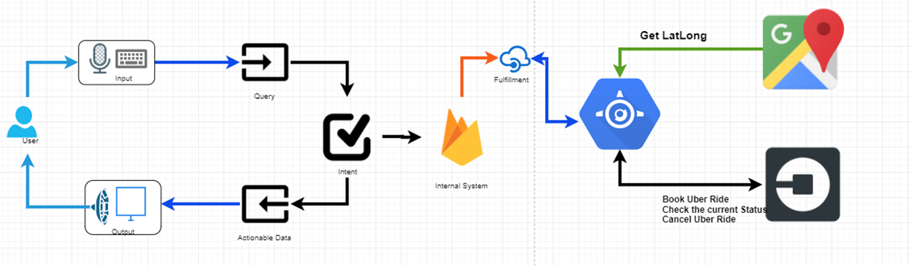
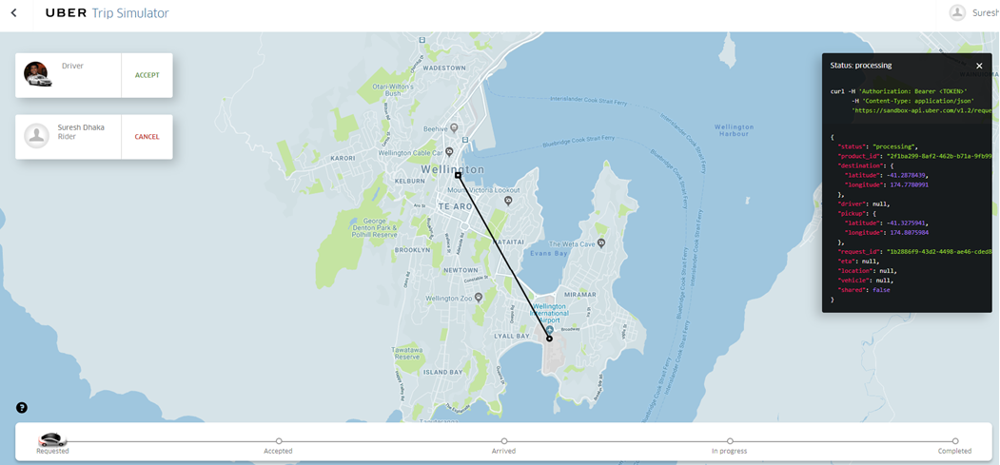

# dialogflow-uber-gmap
This is a POC to book an Uber cab using Google Dialogflow, Uber sandbox and Google Maps.

This project involves integration between Google Dialoflow, GMaps, and Uber sandbox using WSO2 ESB running on GCP Compute. The Google location API currently pointing to the static Lat/Long address to book to and from, however you can update the code to use Google location/map provided Lat/Long.

# Project Structure:
```bash
├── UberDialogflow
├── UBEREsbConfig_CAPP_1.0.0
├── Google Dialog Flow.pptx
├── flow diagram
├── README.md
└── certs

```

## UberDialogflow
This section contains exported model of Googld dialogflow, it requiore to UPDATE WSO2ESB API path in ``` ./UberDialogflow/agend.json```. 
> Please substitue **UPDATE_WSO2ESB_API_SERVER_URL**.


## UBEREsbConfig_CAPP_1.0.0
This section contains WSO2 ESB API specs and implementation. This API is responsible to make requests to Google Maps and UBer sandbox API's for various operations requested by Google Dialogflow.

This section requires you to import few Google and Uber certificates to trust store for secure API communication. 
> Please substiture the values of **UPDATE_GOOGLE_TOKEN_HERE** and **UPDATE_UBER_TOKEN_HERE** in the file ``` ./UBEREsbConfig_CAPP_1.0.0/UBERApi_1.0.0/UBERApi-1.0.0.xml```.

---

|Token|Description| Obtain|
|--------|--------------------------------------------------|-----------------------------|
|UPDATE_UBER_TOKEN_HERE| This is an API token to be used for UBER sandbox enrionment| Please check Uber developer console [here](https://developer.uber.com/docs/riders/guides/authentication/introduction)|
|UPDATE_GOOGLE_TOKEN_HERE| This is an Google API token which need to be generated against any project which you will create in GCP console| Please create a project on GCP and generate API token against GMAP and Google location services, click [here](https://console.cloud.google.com/home/dashboard)|


## End to End Connectivity
This is an end to end connectivity to understand how the user intract with Google dialogflow to Uber.




## Uber dashboard


# References
- https://dialogflow.com/
- https://console.cloud.google.com/home/dashboard
- https://developer.uber.com/docs/riders/guides/authentication/introduction
